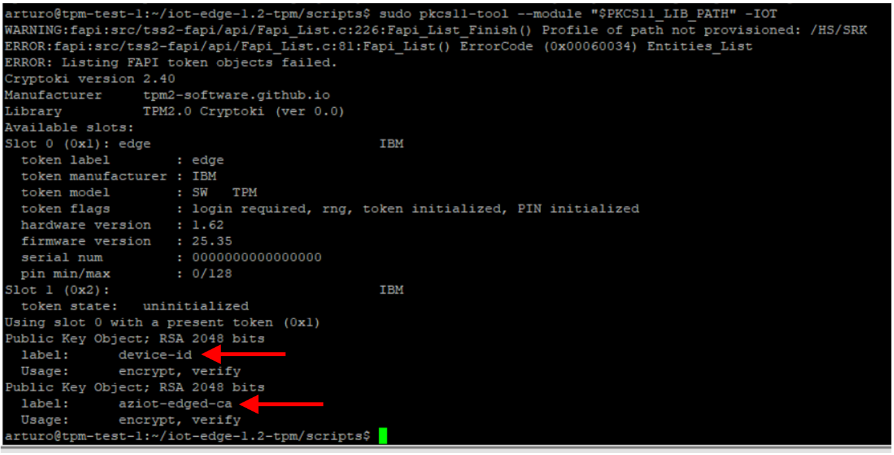

# Overview
This guide explains how to provision an IoT Edge 1.2 via DPS, using an Identity Certificate dynamically issued by a CA via EST, with all the keys securely stored in an HSM implemented with a TPM and PKCS11. 

All the required components (including a simulated TPM if needed) are installed running few scripts included in this repo.

## Disclaimer  

**Samples in this repo are for demonstration purposes only! This is not a guidance or best practices on IoT Edge security.**  

## Get started

Install git if you haven't it:
```bash
sudo apt-get install git -y
```

Grab the scripts from this repo:
```bash
cd ~
git clone https://github.com/arlotito/iot-edge-1.2-tpm.git
cd iot-edge-1.2-tpm/scripts
chmod +x *.sh
```
Once you have the scripts:
1. **install** using either a one-click or step-by-step approach:
   * [one-click deployment](./one-click.md) on Azure: you will get an Ubuntu 18.04 VM ready to go
   * [step-by-step installation](./step-by-step.md) on your own environment (physical or virtual machine, either x86 or ARM)
2. [**troubleshoot**](./troubleshooting.md) if needed
3. [**experiment**](./bonus.md)

## I deployed/performed all the steps, now what?

If everything went fine, you should now have an IoT Edge provisioned via DPS, using an Identity Certificate dynamically issued by a CA via EST, with private keys securely stored in the TPM/PKCS11.

If you want, you can now inspect the content of the PKCS11 store and see the private keys generated by IoT Edge: 

```bash
export TPM2_PKCS11_STORE='/opt/tpm2-pkcs11'
export PKCS11_LIB_PATH='/usr/local/lib/libtpm2_pkcs11.so'
sudo pkcs11-tool --module "$PKCS11_LIB_PATH" -IOT
```
> **_NOTE:_**  the 'pkcs11-tool' is installed by script [3-install-pkcs11-tool.sh](./scripts/3-install-pkcs11-tool.sh)
> 
...and make sure you have 'device-id' and 'aziot-edged-ca':
  


If you don't see any key or just the 'device-id', try with:
```bash
sudo iotedge system reprovision
```

Look at [this](./troubleshooting.md) for additional troubleshooting.

## Tested configurations
This guide has been tested on:
* x86:
  * Ubuntu 18.04, both a physical x86 machine and virtual machine, using a [simulated TPM](./step-by-step.md#2---install-and-configure-a-sw-or-hw-tpm)
* ARM:
  * raspberry pi 4 with Raspberry OS 32bit (which is based on Debian 10 Buster)
    * with a [simulated TPM](./step-by-step.md#2---install-and-configure-a-sw-or-hw-tpm)
    * with an [HW Infineon Optiga SLB9670 TPM 2.0](./step-by-step.md#2---install-and-configure-a-sw-or-hw-tpm)

## References  

- [A lightweight PKI based on Azure KeyVault with an EST Endpoint](https://github.com/vslepakov/keyvault-ca)
- [GlobalSign EST server](https://github.com/arlotito/est)
- [Cisco libest EST server](https://github.com/cisco/libest)
- [The blueprint to securely solve the elusive zero-touch provisioning of IoT devices at scale](https://azure.microsoft.com/en-us/blog/the-blueprint-to-securely-solve-the-elusive-zerotouch-provisioning-of-iot-devices-at-scale/)
- [TPM JS](https://google.github.io/tpm-js/)
