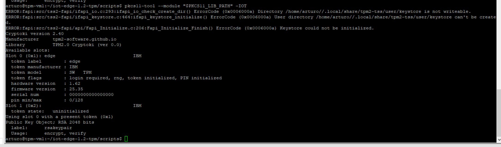
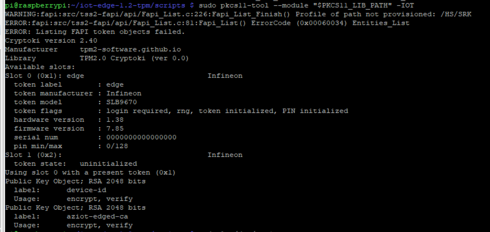
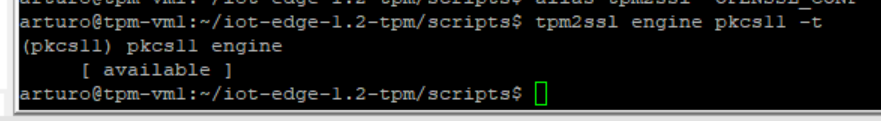

# BONUS

## Inspect the PKCS11 store
```bash
export TPM2_PKCS11_STORE='/opt/tpm2-pkcs11'
export PKCS11_LIB_PATH='/usr/local/lib/libtpm2_pkcs11.so'
sudo pkcs11-tool --module "$PKCS11_LIB_PATH" -IOT
```
Expected result with the simulated TPM:
* IBM SW TPM
* Slot 0 initialized with token 'edge'
* some keys (yours, the ones generated by iot edge, ...)
  


Here's the outcome in case of an Hardware TPM:
  


> **_NOTE:_**  the 'pkcs11-tool' is installed by script [3-2-install-pkcs11-tool.sh](./scripts/3-2-install-pkcs11-tool.sh)

## Create a keypair
Create a keypair:
```bash
./9-1-create-keypair.sh
```

The generated keypair is stored in the PKCS11. View it by [inspecting the content of the PKCS11 store](#bonus-inspect-the-pkcs11-store).
## Use openssl with the TPM via PKCS11
Install and configure a pkcs11 engine for openssl on a x86:
```bash
./9-2-openssl-x86.sh
```

...and on a ARM:
```bash
./9-2-openssl-arm.sh
```

Let's test that openssl can use the pkcs11 as an engine:
```bash
alias tpm2ssl='OPENSSL_CONF=~/tpm2-pkcs11.openssl.conf openssl'
tpm2ssl engine pkcs11 -t
```

Expected result: engine available
