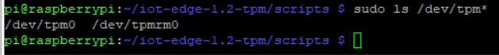

# Step-by-step installation using scripts

Just follow these steps:
- [0 - Ubuntu 18.04 fix](#0---ubuntu-1804-fix)
- [1 - Install tpm2 software and PKCS11](#1---install-tpm2-software-and-pkcs11)
- [2 - Install and configure an HW or simulated TPM](#2---install-and-configure-a-sw-or-hw-tpm)
- [3 - Ubuntu fix, pkcs11-tool installation](#2---install-and-configure-an-hw-or-simulated-tpm)
- [4 - Install IoT Edge 1.2](#4---install-iot-edge-12)
- [5 - Init the PKCS11 store](#5---init-the-pkcs11-store)
- [6 - Configure IoT Edge](#6---configure-iot-edge)
- [That's all folks](#thats-all-folks)

Bonus:
- [BONUS: Inspect the PKCS11 store](#bonus-inspect-the-pkcs11-store)
- [BONUS: using openssl with the TPM via PKCS11](#bonus-using-openssl-with-the-tpm-via-pkcs11)
- [BONUS: create a keypair](#bonus-create-a-keypair)

Pre-requisites:
* an x86/Ubuntu 18.04 physical or virtual machine

Resources:
* https://azure.github.io/iot-identity-service/dev/running/pkcs11/
* https://google.github.io/tpm-js, a great and interactive tutorial around TPM basics
## 0 - Ubuntu 18.04 fix
> **_NOTE:_**  This step applies to Ubuntu 18.04 only.

Ubuntu 18.04 ships with Python 3.6, while some of the tools used later on require python >=3.7

To install Python 3.7 (and fix apt, that may get corrupted):
```bash
./0-1-fix-ubuntu-18.04.sh
```
 

## 1 - Install tpm2 software and PKCS11
Execute all the 1-x scripts, one-by-one, as follows:
```bash
./1-1-download-libs.sh
./1-2-build-tpm2-tss.sh
./1-3-build-tpm2-abmrd.sh
./1-4-build-tpm2-tools.sh
./1-5-build-tpm2-pkcs11.sh
```

## 2 - Install and configure a SW or HW TPM 
You can use either an SW (i.e. simulated) TPM or a real HW TPM 2.0, without any impact on the other steps.

* **Simulated TPM**
  
  To install the simulated TPM, just launch this script and proceed to step 3.
  ```bash
  ./2-install-vtpm.sh
  ```

* **Hardware TPM**
  
  You can use any hardware TPM v2.0, already embedded in your HW or plugged as a module.
  
  Steps to physically install and configure the TPM module may vary depending on the TPM/Module vendor and the host platform.
  
  In case of a Raspberry PI 3 or 4, you may consider [this](https://letstrust.de/) module, which is embedding an Infineon Optiga SLB9670 TPM 2.0. Follow the instructions the simple steps (from [here](https://github.com/PaulKissinger/LetsTrust)):
  1. Open a (whatever) term on your Pi.
  2. run a "sudo apt update && upgrade"
  3. open the /boot/config.txt with "sudo nano /boot/config.txt" and:
      * activate SPI with "dtparam=spi=on"
      * load the TPM device tree overlay with "dtoverlay=tpm-slb9670"
  4. plug your LetsTrust-TPM on the *right position*
      > **_NOTE:_** be careful, otherwise you'll damage the module and the raspberry!
  5. reboot your Raspberry Pi
  6. open a terminal on your Pi and type:
      ```language
      ls /dev/tpm*
      ```
      and you should see /dev/tpm0 and /dev/tpmrm0 will appear in yellow letters!

        


## 3 - pkcs11-tool installation
To install pkcs11-tool:
```bash
./3-install-pkcs11-tool.sh
```

## 4 - Install IoT Edge 1.2
Install IoT Edge 1.2 following the official documentation [here](https://docs.microsoft.com/en-us/azure/iot-edge/how-to-install-iot-edge?view=iotedge-2020-11), or just launch the script matching your platform:

* for x86:
  ```bash
  ./4-install-edge-x86.sh
  ```

* for raspberry pi 3/4:
  ```bash
  ./4-install-edge-rpi.sh
  ```

## 5 - Init the PKCS11 store
Initialize the PKCS11 store and create the token 'edge' with PIN '1234':
```bash
./5-pkcs11-init.sh
```

## 6 - Configure IoT Edge
It's now time to configure the IoT edge to provision via DPS, using an Identity Certificate dynamically issued by a CA via EST, with all the keys securely stored in TPM/PKCS11.

Just launch the following script:
```bash
./6-iot-edge-config.sh
```
...and provide the  configuration info (reg id, dps scope, est url and credentials) when prompted.  
> **_NOTE:_** In case you do not have a PKI or an EST endpoint but still want to give it a try, please refer to [this project](https://github.com/vslepakov/keyvault-ca).  
> It lets you create a lightweight PKI based on Azure KeyVault and also exposes an EST enpoint which is tested and works with IoT Edge.

> **_NOTE:_**  for the time being, this guide covers only username/password EST auth. Working on the EST Identity cert authentication.

That script will create and apply a config.toml based on this [template](./scripts/config.toml.est.template).
